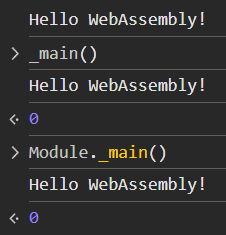
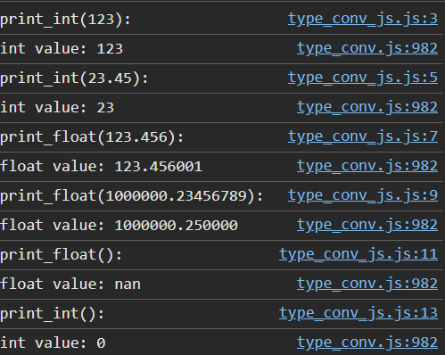
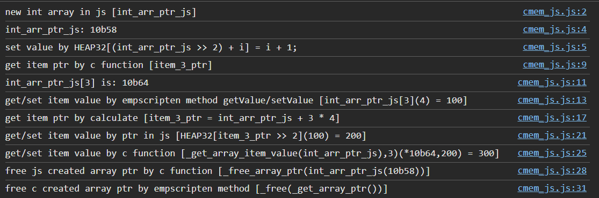
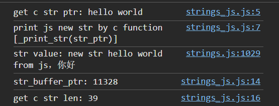
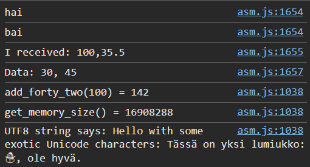
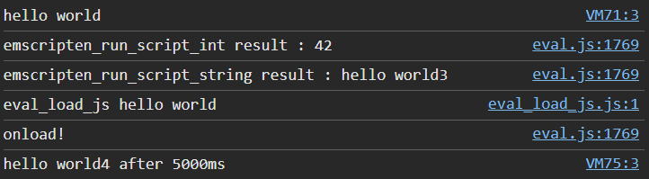
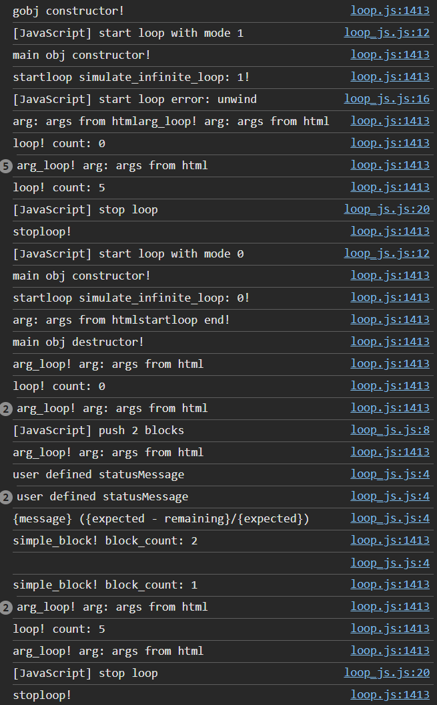

# WebAssembly笔记

## 开始

### 安装Emscripten

<i style="color:grey;">用于将C++代码编译为wasm</i>

下载后到emsdk所在目录（D:\Program\Compilers\emscripten\emsdk）

```batch
./emsdk update
./emsdk install latest
```

安装后激活

```batch
./emsdk activate latest
```

设置环境变量:

```batch
emsdk_env.bat
```

安装成功后查看版本信息

```batch
emcc -v
```

### Hello World!

```c++
//hello.cc
#include<stdio.h>
int main(){
    printf("hello world");
}
```

```batch
emcc hello.cc -o hello.js
```

然后在网页中导入即可在控制台看到结果:<i style="color:grey;">_依然需要上线网页_</i>

```html
<script src="hello.js"></script>
```

<span style="color:#4f7;">也可直接用node.js运行</span>

```batch
node hello.js
```

编译生成测试网页<i style="color:grey">wasm的测试网页</i>

```batch
emcc hello.cc -o hello.html
```

在控制台中使用_main()与Module._main()均可以调用函数



<span style="color:red;font-weight:bold;">需要先加载好才能调用函数否则将报错：</span>

```html
<script src="/code/cpp/wasm/hello.js"></script>
  <script>
    _main()
  </script>
```

错误信息：

```text
Aborted(Assertion failed: call to '_main' via reference taken before Wasm module initialization)
```

### 异步加载

<span style="color:#4f7;">Tip:可以采取main()函数回调的方式完成</span>

可采取Module.onRuntimeInitialized回调函数

```javascript
Module.onRuntimeInitialized = function() {
  console.log("ready");
}
```

### 编译目标

> Emscripten早于WebAssembly，所以WebAssembly诞生前Emscripten长期用于编译asm.js

若要编译为asm，使用 `-s WASM=0`

```batch
emcc hello.cc -s WASM=0 -o hello_asm.js
```

## JavaScript与C通信

### JavaScript调用C函数

#### 编译时导出C函数

可以在编译时采用 `-s EXPORTED_FUNCTIONS=‘[”_function1“,"_function2"]’` <span style="color:red;font-weight:bold;">注意，由于需要导出的函数必须要用C语言风格函数前要加下划线，c++文件导出的函数前加 `extern "C"`</span>

```c
//export.c
int add(int a, int b)
{
    return a + b;
}
```

<i style="color:grey;">一定要加EXPORTED_FUNCTIONS，不加不行(试过了)</i>

<i style="color:grey;">另外，在我的电脑上单引号和双引号互换是没关系的</i>

```batch
emcc -s EXPORTED_FUNCTIONS='["_add"]' cpp/src/export.cc -o cpp/wasm/export.js 
```

然后就可以在console里面调用`_add`了

#### 使用宏导出C函数

可以定义一个导出宏，用于使函数在导出时不被编译器优化掉：

```c++
//ems_export.h 本人写
#ifndef EMS_EXPORT_H
#   define EMS_EXPORT_H
#   ifndef EM_PORT_API
#       if defined(__EMSCRIPTEN__)
#           include <emscripten/emscripten.h>
#           if defined(__cplusplus)
#               define EM_PORT_API(rettype) extern "C" rettype EMSCRIPTEN_KEEPALIVE
#           else
#               define EM_PORT_API(rettype) rettype EMSCRIPTEN_KEEPALIVE
#           endif
#       else
#           if defined(__cplusplus)
#               define EM_PORT_API(rettype) extern "C" rettype
#           else
#               define EM_PORT_API(rettype) rettype
#           endif
#       endif
#   endif
#endif
```

写在函数的返回类型上面

```c++
#include "../include/ems_export.h"
EM_PORT_API(int) add(int a, int b)
{
    return a + b;
}
```

<span style="color:#4f7;">JavaScript在调用C函数时，多余的参数将会被省略，少参数则填充undefined</span>

> 上面例子中，add(3) (缺少参数)将返回NaN

### C调用JavaScript函数

#### 通过js文件引入JavaScript函数

实现js函数，并通过`mergeInto`（旧方法）或`addToLibrary`（新方法）声明这些方法将导入到C中

```js
//jsadd.js
mergeInto(LibraryManager.library, {
    js_add: function(a, b) {
        return a + b;
    },
    js_log: function(numb) {
        console.log(numb);
    }
});
```

或是

```js
addToLibrary({
  js_add: function(a, b) {
    return a + b;
  },
  js_log: function(numb) {
    console.log(numb);
  },
});
```

在C中申明此函数

```c++
//import.cpp
#include "../include/ems_export.h"
int a=6,b=9;
EM_PORT_API(int) js_add(int a,int b);
EM_PORT_API(void) js_log(int numb);
EM_PORT_API(void) calladd()
{
    int c=js_add(a,b);
    js_log(c);
}
```

编译时加上`--js-library` +含需要导出函数的js文件，将该文件作为附加库链接

```text
em++ cpp/src/import.cpp -o cpp/wasm/import.js --js-library cpp/jsmodule/jsadd.js
```

### 单向透明内存

#### 可用内存大小

当前版本的Emscripten(4.0.23)中，指针类型为int32，即最大可用内存为2GB - 1，未定义的情况下（Emscripten 4.0.23），栈容量（STACK_SIZE）为64KB，堆容量16MB，设置`ALLOW_MEMORY_GROWTH`后，`MAXIMUM_MEMORY`生效，内存可扩展至2GB。

> #### [STACK_SIZE](https://emscripten.webassembly.net.cn/docs/tools_reference/settings_reference.html#stack-size "Permalink to this headline")
> 
> 总堆栈大小。无法扩大堆栈，因此该值必须足够大以满足程序的要求。如果断言打开，我们将在不超过此值的情况下断言，否则，它会静默失败。
> 
> 默认值：64*1024
> 
> --------------
> 
> #### [INITIAL_HEAP](https://emscripten.webassembly.net.cn/docs/tools_reference/settings_reference.html#initial-heap)
> 
> 程序可用的初始堆内存量。这是通过 sbrk、malloc 和 new 可用于动态分配的内存区域。
> 
> 与 INITIAL_MEMORY 不同，此设置允许程序内存的静态区域和动态区域独立增长。在大多数情况下，我们建议使用此设置而不是 INITIAL_MEMORY。但是，此设置不适用于导入的内存（例如，当使用动态链接时）。
> 
> 默认值：16777216
> 
> --------------
> 
> #### [INITIAL_MEMORY](https://emscripten.webassembly.net.cn/docs/tools_reference/settings_reference.html#initial-memory)
> 
> 要使用的初始内存量。使用超过此内存量的内存会导致我们扩展堆，这对于类型化数组来说可能很昂贵：在这种情况下，我们需要将旧堆复制到新堆中。如果设置了 ALLOW_MEMORY_GROWTH，则此初始内存量可以在以后增加；如果没有，那么它就是最终的总内存量。
> 
> 默认情况下，此值是根据 INITIAL_HEAP、STACK_SIZE 以及输入模块中静态数据的尺寸计算得出的。
> 
> （此选项以前称为 TOTAL_MEMORY。）
> 
> 默认值：-1
> 
> --------------
> 
> #### [MAXIMUM_MEMORY](https://emscripten.webassembly.net.cn/docs/tools_reference/settings_reference.html#maximum-memory)
> 
> 设置 wasm 模块中内存的最大尺寸（以字节为单位）。这仅在设置 ALLOW_MEMORY_GROWTH 时才相关，因为如果没有增长，INITIAL_MEMORY 的大小无论如何都是最终内存的大小。
> 
> 请注意，这里的默认值为 2GB，这意味着默认情况下，如果您启用内存增长，那么我们可以增长到 2GB，但不会更高。2GB 是一个自然的限制，原因有以下几个
> 
> > * 如果最大堆大小超过 2GB，则指针必须在 JavaScript 中无符号，这会增加代码大小。我们不希望内存增长构建更大，除非有人明确选择加入到 >2GB+ 堆中。
> > 
> > * 历史上，没有 VM 支持超过 2GB+，直到最近（2020 年 3 月）才开始出现支持。由于支持有限，对于人们来说，选择加入到 >2GB+ 堆中比获得可能不适用于所有 VM 的构建更安全。
> 
> 要使用超过 2GB，请将其设置为更高的值，例如 4GB。
> 
> （此选项以前称为 WASM_MEM_MAX 和 BINARYEN_MEM_MAX。）
> 
> 默认值：2147483648
> 
> ------------------- 
> 
> #### [ALLOW_MEMORY_GROWTH](https://emscripten.webassembly.net.cn/docs/tools_reference/settings_reference.html#allow-memory-growth)
> 
>  如果为 false，如果我们尝试分配超过我们所能分配的内存（INITIAL_MEMORY），我们就会中止并报错。如果为 true，我们将在运行时无缝动态地增长内存数组。有关 chrome 中内存增长性能的信息，请参见 https://code.google.com/p/v8/issues/detail?id=3907。请注意，增长内存意味着我们替换 JS 类型化数组视图，因为一旦创建，它们就无法调整大小。（在 wasm 中，我们可以增长 Memory，但仍然需要为 JS 创建新的视图。）在该选项上设置此选项将禁用 ABORTING_MALLOC，换句话说，ALLOW_MEMORY_GROWTH 使完全标准的行为生效，即 malloc 在失败时返回 0，并且能够根据需要从系统中分配更多内存。
> 
> 默认值：false

#### 获取和设置值

Emscripten推荐使用 [`getValue(ptr, type)`](https://emscripten.webassembly.net.cn/docs/api_reference/preamble.js.html#getValue "getValue") 和 [`setValue(ptr, value, type)`](https://emscripten.webassembly.net.cn/docs/api_reference/preamble.js.html#setValue "setValue") 访问内存，第一个参数是一个指针（表示内存地址的数字）。 `type` 必须是 LLVM IR 类型，分别是 `i8`、 `i16`、 `i32`、 `i64`、 `float`、 `double` 或指针类型，如 `i8*`（或只是 `*`）。

<span style="color:red;font-weight:bold;">注意，`getValue(ptr, type)`和`setValue(ptr, value, type)`需要在编译时导出，参见<a href="#preamble_js_and_exported_runtime_methods" style="color:inherit">[EXPORTED_RUNTIME_METHODS]</a></span>

#### 读写内存

[Emscripten 内存表示](https://emscripten.webassembly.net.cn/docs/porting/emscripten-runtime-environment.html#emscripten-memory-model) 使用类型化数组缓冲区 (`ArrayBuffer`) 来表示内存，其中不同的视图可以访问不同的类型。用于访问不同类型内存的视图如下。

| 类型      | 解释           |
| ------- | ------------ |
| HEAP8   | 8 位有符号内存的视图  |
| HEAP16  | 16 位有符号内存的视图 |
| HEAP32  | 32 位有符号内存的视图 |
| HEAPU8  | 8 位无符号内存的视图  |
| HEAPU16 | 16 位无符号内存的视图 |
| HEAPU32 | 32 位无符号内存的视图 |
| HEAPF32 | 32 位浮点内存的视图  |
| HEAPF64 | 64 位浮点内存的视图  |

<span style="color:#4f7;">对内存进行读写时，需要通过<a href="#preamble_js_and_exported_runtime_methods" style="color:inherit">[EXPORTED_RUNTIME_METHODS]</a>导出相应类型视图，如`-sEXPORTED_RUNTIME_METHODS=HEAP32`。</span>

<span style="color:#4f7;">使用时，注意内存地址与视图元素索引的转换，如`HEAP32`需要将内存地址除以4才能得到对应的元素（使用类似`ptr>>2`的表达式记得加括号，因为`+`/`-`优先级大于`>>`/`<<`）</span>

相关使用示例详见<a href="#heap_malloc_free_example" style="color:inherit">"在JavaScript中申请内存"</a>，

#### 数据交换

<span style="color:#4f7;">JavaScript与C之间只能通过number进行参数何返回值的传递，number传入时，若C中类型为int则向0取整，若为float则可能造成精度丢失。</span>

```c++
//type_conv.cpp
#include "../include/ems_export.h"
#include <stdio.h>
EM_PORT_API(void) print_int(int value){
    printf("int value: %d\n", value);
}
EM_PORT_API(void) print_float(float value){
    printf("float value: %f\n", value);
}
```

```javascript
//type_conv_js.js
Module = {}
Module.onRuntimeInitialized = function() {
  console.log(`print_int(123):`);
  _print_int(123)
  console.log(`print_int(23.45):`);
  _print_int(23.45)
  console.log(`print_float(123.456):`);
  _print_float(123.456)
  console.log(`print_float(1000000.23456789):`);
  _print_float(1000000.23456789)
  console.log(`print_float():`);
  _print_float()
  console.log(`print_int():`);
  _print_int()
} 
```

结果



#### 通过内存交换数据

可通过传递数组指针来传递数据，通过

#### 在JavaScript中申请内存<span id="heap_malloc_free_example"> </span>

可通过在编译时添加`-sEXPORTED_FUNCTIONS=_malloc,_free`来暴露malloc与free函数。

```c++
//cmem.cpp
#include "../include/ems_export.h"
#include <malloc.h>

EM_PORT_API(int *) get_array_ptr(){
    return (int *) malloc(10 * sizeof(int));
};

EM_PORT_API(void) free_array_ptr(int *ptr){
    free(ptr);
};

EM_PORT_API(void) set_array_item_value(int *ptr, int index, int value){
    ptr[index] = value;
};

EM_PORT_API(int) get_array_item_value(int *ptr, int index){
    return ptr[index];
};

EM_PORT_API(int *) get_array_item_ptr(int *ptr, int index){
    return &ptr[index];
}; 
```

编译

```batch
em++ cpp/src/cmem.cpp -o cpp/wasm/cmem.js -sEXPORTED_RUNTIME_METHODS=setValue,getValue,HEAP32 -sEXPORTED_FUNCTIONS=_malloc,_free
```

在js中调用

```javascript
//cmem_js.js
Module.onRuntimeInitialized = function() {
  console.log(`new int array in js [int_arr_ptr_js]`);
  var int_arr_ptr_js = _malloc(10 * 4);
  console.log("int_arr_ptr_js: "+int_arr_ptr_js.toString(16));
  console.log(`set value by HEAP32[(int_arr_ptr_js >> 2) + i] = i + 1;`);
  for(let i = 0;i<10;i++){
    HEAP32[(int_arr_ptr_js >> 2) + i] = i + 1;
  }
  console.log(`get item ptr by c function [item_3_ptr]`);
  let item_3_ptr = _get_array_item_ptr(int_arr_ptr_js,3);
  console.log(`int_arr_ptr_js[3] is: ${item_3_ptr.toString(16)}`);

  console.log(`get/set item value by empscripten method getValue/setValue [int_arr_ptr_js[3](${getValue(item_3_ptr)}) = 100]`);
  setValue(item_3_ptr,100);


  console.log(`get item ptr by calculate [item_3_ptr = int_arr_ptr_js + 3 * 4]`);
  item_3_ptr = int_arr_ptr_js + 3 * 4;


  console.log(`get/set item value by ptr in js [HEAP32[item_3_ptr >> 2](${HEAP32[item_3_ptr >> 2]}) = 200]`);
  HEAP32[item_3_ptr >> 2] = 200;


  console.log(`get/set item value by c function [_get_array_item_value(int_arr_ptr_js),3)(*${_get_array_item_ptr(int_arr_ptr_js,3).toString(16)},${_get_array_item_value(int_arr_ptr_js,3)}) = 300]`);
  _set_array_item_value(int_arr_ptr_js,3,300);

  console.log(`free js created array ptr by c function [_free_array_ptr(int_arr_ptr_js(${int_arr_ptr_js.toString(16)}))]`);
  _free_array_ptr(int_arr_ptr_js);

  console.log(`free c created array ptr by empscripten method [_free(_get_array_ptr())]`);
  _free(_get_array_ptr());
}
```

运行结果: <i style="color:grey;">html页面仅引入了两个js文件，所以不展示代码</i>



### 字符串处理

JavaScript 字符串 `someString` 可以使用 `ptr = stringToNewUTF8(someString)` 转换为 `char *`。(貌似并没有~~stringToNewUTF16~~等)<span style="color:red;font-weight:bold;">转换为指针会分配内存，需要通过调用 `free(ptr)` 来释放内存（在 JavaScript 侧为 `_free`）</span><span style="color:#4f7;">可以通过`lengthBytesUTF8``lengthBytesUTF16``lengthBytesUTF32`在JavaScript中计算JavaScript字符串占用的字节大小（无需在编译时导出）</span>

除此之外还有以下方式处理字符串：

#### `UTF8ToString`(_ptr_[, _maxBytesToRead_])

给定一个指向 Emscripten HEAP 中以空终止的 UTF8 编码字符串的指针 `ptr`，返回该字符串的副本，作为 JavaScript `String` 对象。

参数

* **ptr** – 指向 Emscripten HEAP 中以空终止的 UTF8 编码字符串的指针。

* **maxBytesToRead** – 一个可选的长度，指定要读取的最大字节数。可以省略此参数来扫描字符串，直到第一个 0 字节。如果传递了 maxBytesToRead，并且 `[ptr, ptr+maxBytesToReadr)` 中的字符串在中间包含一个空字节，则该字符串将在该字节索引处被截断（即 maxBytesToRead 不会生成一个长度精确为 `[ptr, ptr+maxBytesToRead)` 的字符串）请注意，频繁地使用 `UTF8ToString()`（带有和不带有 maxBytesToRead）可能会扰乱 JS JIT 优化，因此值得考虑始终如一地使用其中一种风格。

返回值

一个 JavaScript `String` 对象

---

#### `stringToUTF8`(_str_, _outPtr_, _maxBytesToWrite_)

将给定的 JavaScript `String` 对象 `str` 复制到 Emscripten HEAP 的地址 `outPtr`，以空终止，并以 UTF8 形式编码。

复制将最多需要 `str.length*4+1` 字节的 HEAP 空间。可以使用 `lengthBytesUTF8()` 函数计算对字符串进行编码所需的精确字节数（不包括空终止符）。

参数

* **str** (_String_) – 一个 JavaScript `String` 对象。

* **outPtr** – 指向从 `str` 复制的数据的指针，以 UTF8 格式编码，并以空终止。

* **maxBytesToWrite** – 此函数最多可以写入的字节数限制。如果字符串比此更长，则输出将被截断。即使发生截断，输出的字符串也将始终以空终止，只要 `maxBytesToWrite > 0`。

---

#### `UTF16ToString`(_ptr_)

给定一个指向 Emscripten HEAP 中以空终止的 UTF16LE 编码字符串的指针 `ptr`，返回该字符串的副本，作为 JavaScript `String` 对象。

参数

* **ptr** – 指向 Emscripten HEAP 中以空终止的 UTF16LE 编码字符串的指针。

返回值

一个 JavaScript `String` 对象

---

#### `stringToUTF16`(_str_, _outPtr_, _maxBytesToWrite_)

将给定的 JavaScript `String` 对象 `str` 复制到 Emscripten HEAP 的地址 `outPtr`，以空终止，并以 UTF16LE 形式编码。

复制将需要 HEAP 中的 `(str.length+1)*2` 字节空间。

参数

* **str** (_String_) – 一个 JavaScript `String` 对象。

* **outPtr** – 指向从 `str` 复制的数据的指针，以 UTF16LE 格式编码，并以空终止。

* **maxBytesToWrite** – 此函数最多可以写入的字节数限制。如果字符串比此更长，则输出将被截断。即使发生截断，输出的字符串也将始终以空终止，只要 `maxBytesToWrite >= 2`，以便有空间用于空终止符。

---

#### `UTF32ToString`(_ptr)_

给定一个指向 Emscripten HEAP 中以空终止的 UTF32LE 编码字符串的指针 `ptr`，返回该字符串的副本，作为 JavaScript `String` 对象。

参数

* **ptr** – 指向 Emscripten HEAP 中以空终止的 UTF32LE 编码字符串的指针。

返回值

一个 JavaScript `String` 对象。

-------

#### `stringToUTF32`(_str_, _outPtr_, _maxBytesToWrite_)

将给定的 JavaScript `String` 对象 `str` 复制到 Emscripten HEAP 的地址 `outPtr`，以空终止，并以 UTF32LE 形式编码。

复制将最多需要 `(str.length+1)*4` 字节的 HEAP 空间，但可以使用更少的空间，因为 `str.length` 不会返回字符串中字符的数量，而是返回字符串中 UTF-16 代码单元的数量。可以使用 `lengthBytesUTF32()` 函数计算对字符串进行编码所需的精确字节数（不包括空终止符）。

参数

* **str** (_String_) – 一个 JavaScript `String` 对象。

* **outPtr** – 指向从 `str` 复制的数据的指针，以 UTF32LE 格式编码，并以空终止。

* **maxBytesToWrite** – 此函数最多可以写入的字节数限制。如果字符串比此更长，则输出将被截断。即使发生截断，输出的字符串也将始终以空终止，只要 `maxBytesToWrite >= 4`，以便有空间用于空终止符。

---

#### `AsciiToString`(_ptr_)

将 ASCII 或 Latin-1 编码字符串转换为 JavaScript String 对象。

参数

* **ptr** – 要转换为 `String` 的指针。

返回值

一个 JavaScript `String`，包含来自 `ptr` 的数据。

返回值类型

String

---

#### `intArrayFromString`(_stringy_, _dontAddNull_[, _length_])

这会将 JavaScript 字符串转换为以 0 结尾的 C 行数字数组。

参数

* **stringy** (_String_) – 要转换的字符串。

* **dontAddNull** (_bool_) – 如果 `true`，则新数组不会以零结尾。

* **长度** – 数组的长度（可选）。

返回值

从 `stringy` 创建的数组。

---

#### `intArrayToString`(_array_)

这将从一个以零结尾的 C 行数字数组创建一个 JavaScript 字符串。

参数

* **array** – 要转换的数组。

返回值

一个 `String`，包含 `array` 的内容。

---

#### `writeArrayToMemory`(_array_, _buffer_)

将数组写入堆中的指定地址。请注意，在写入数组之前，应该为数组分配内存。

参数

* **array** – 要写入内存的数组。

* **buffer** (_Number_) – `array` 要写入的地址（数字）。

---

#### 示例代码

```c++
//strings.cpp
#include "../include/ems_export.h"
#include <malloc.h>
#include <stdio.h>
#include <string.h>

const char* str = "hello world";

EM_PORT_API(void) print_str(char* str){
    printf("str value: %s\n", str);
}

EM_PORT_API(void*) get_c_str(){
    return (void *) str;
}
EM_PORT_API(void *) malloc_str(int len){
    return (void *) malloc(len);
}
EM_PORT_API(int) get_c_str_len(void* str){
    return strlen((char *) str);
}
```

```javascript
//strings_js.js
Module = {}
Module.onRuntimeInitialized = function() {
  console.log(`get c str ptr: ${UTF8ToString(_get_c_str())}`);
  let str_ptr = stringToNewUTF8("new str hello world from js，你好");
  console.log(`print js new str by c function [_print_str(str_ptr)]`);
  _print_str(str_ptr);

  let js_str = "normal str hello world from js，你好";
  let str_buffer_ptr = _malloc_str(100);
  console.log(`str_buffer_ptr: ${str_buffer_ptr.toString(16)}`);
  stringToUTF8(js_str,str_buffer_ptr,100);
  console.log(`get c str len: ${_get_c_str_len(str_buffer_ptr)}`);
  _free(str_buffer_ptr);
}
```

```batch
em++ cpp/src/strings.cpp -o cpp/wasm/strings.js -s EXPORTED_RUNTIME_METHODS=stringToNewUTF8,stringToUTF8  -sEXPORTED_FUNCTIONS=_malloc,_free
```

运行结果：

 

### ES_ASM系列

从 C 调用 JavaScript 的更快方法是编写“内联 JavaScript”，使用 [`EM_JS()`](https://emscripten.webassembly.net.cn/docs/api_reference/emscripten.h.html#c.EM_JS "EM_JS") 或 [`EM_ASM()`](https://emscripten.webassembly.net.cn/docs/api_reference/emscripten.h.html#c.EM_ASM "EM_ASM")（以及相关的宏）。

> #### `EM_JS`(return_type, function_name, arguments, code)
> 
> 用于 JavaScript 库函数的便捷语法。
> 
> 这允许您在 C 代码中将 JavaScript 声明为函数，该函数可以像普通 C 函数一样调用。例如，以下 C 程序如果用 Emscripten 编译并在浏览器中运行，将显示两个警报
> 
> ```c++
> EM_JS(void, two_alerts, (), {
>   alert('hai');
>   alert('bai');
> });
> 
> int main() {
>   two_alerts();
>   return 0;
> }
> ```
> 
> 参数可以像普通 C 参数一样传递，并且在 JavaScript 代码中具有相同的名称。这些参数可以是 `int32_t` 或 `double` 类型。
> 
> ```c++
> EM_JS(void, take_args, (int x, float y), {
>   console.log('I received: ' + [x, y]);
> });
> 
> int main() {
>   take_args(100, 35.5);
>   return 0;
> }
> ```
> 
> 以 null 结尾的 C 字符串也可以传递到 `EM_JS` 函数中，但要对它们进行操作，需要将它们从堆中复制出来以转换为高级 JavaScript 字符串。
> 
> ```c++
> EM_JS(void, say_hello, (const char* str), {
>   console.log('hello ' + UTF8ToString(str));
> });
> ```
> 
> 以相同的方式，可以将指向任何类型（包括 `void *`）的指针传递到 `EM_JS` 代码中，它们在那里显示为整数，就像上面的 `char *` 指针一样。可以通过直接读取堆来管理对数据的访问。
> 
> ```c++
> EM_JS(void, read_data, (int* data), {
>   console.log('Data: ' + HEAP32[data>>2] + ', ' + HEAP32[(data+4)>>2]);
> });
> 
> int main() {
>   int arr[2] = { 30, 45 };
>   read_data(arr);
>   return 0;
> });
> ```
> 
> 此外，EM_JS 函数可以将值返回给 C 代码。输出值使用 `return` 语句传回
> 
> ```c++
> EM_JS(int, add_forty_two, (int n), {
>   return n + 42;
> });
> 
> EM_JS(int, get_memory_size, (), {
>   return HEAP8.length;
> });
> 
> int main() {
>   int x = add_forty_two(100);
>   int y = get_memory_size();
>   // ...
> }
> ```
> 
> 字符串可以从 JavaScript 返回到 C，但需要小心内存管理。
> 
> ```c++
> EM_JS(char*, get_unicode_str, (), {
>   var jsString = 'Hello with some exotic Unicode characters: Tässä on yksi lumiukko: ☃, ole hyvä.';
>   // 'jsString.length' would return the length of the string as UTF-16
>   // units, but Emscripten C strings operate as UTF-8.
>   return stringToNewUTF8(jsString);
> });
> 
> int main() {
>   char* str = get_unicode_str();
>   printf("UTF8 string says: %s\n", str);
>   // Each call to _malloc() must be paired with free(), or heap memory will leak!
>   free(str);
>   return 0;
> }
> ```
> 
> #### `EM_ASM`(...)
> 
> 用于内联汇编/JavaScript 的便捷语法。
> 
> 这允许您在 C 代码中“内联”声明 JavaScript，然后在编译后的代码在浏览器中运行时执行它。例如，以下 C 代码如果用 Emscripten 编译并在浏览器中运行，将显示两个警报
> 
> ```c++
> EM_ASM(alert('hai'); alert('bai'))
> ```
> 
> 参数可以传递到 JavaScript 代码块中，它们在那里作为变量 `$0`、`$1` 等出现。这些参数可以是 `int32_t` 或 `double` 类型。
> 
> ```c++
> EM_ASM({
>   console.log('I received: ' + [$0, $1]);
> }, 100, 35.5);
> ```
> 
> 请注意 `{` 和 `}`。
> 
> 以 null 结尾的 C 字符串也可以传递到 `EM_ASM` 块中，但要对它们进行操作，需要将它们从堆中复制出来以转换为高级 JavaScript 字符串。
> 
> ```c++
> EM_ASM(console.log('hello ' + UTF8ToString($0)), "world!");
> ```
> 
> 以相同的方式，可以将指向任何类型（包括 `void *`）的指针传递到 `EM_ASM` 代码中，它们在那里显示为整数，就像上面的 `char *` 指针一样。可以通过直接读取堆来管理对数据的访问。
> 
> ```c++
> int arr[2] = { 30, 45 };
> EM_ASM({
>   console.log('Data: ' + HEAP32[$0>>2] + ', ' + HEAP32[($0+4)>>2]);
> }, arr);
> ```
> 
> <span style="color:red;font-weight:bold;">注意</span>
> 
> * <span style="color:red;font-weight:bold;">从 Emscripten `1.30.4` 开始，`EM_ASM` 代码块的内容出现在正常的 JS 文件中，因此 Closure 编译器和其他 JavaScript 缩减器将能够对它们进行操作。您可能需要在某些地方使用安全引号 (`a['b']` 而不是 `a.b`) 以避免缩减发生。</span>
> 
> * <span style="color:red;font-weight:bold;">C 预处理器不了解 JavaScript 令牌，因此如果 `code` 块包含逗号字符 `,`，则可能需要将代码块括在圆括号中。例如，代码 `EM_ASM(return [1,2,3].length);` 无法编译，但 `EM_ASM((return [1,2,3].length));` 可以。</span>
> 
> #### `EM_ASM_INT`(code, ...)
> 
> 此宏以及 [`EM_ASM_DOUBLE`](https://emscripten.webassembly.net.cn/docs/api_reference/emscripten.h.html#c.EM_ASM_DOUBLE "EM_ASM_DOUBLE") 和 [`EM_ASM_PTR`](https://emscripten.webassembly.net.cn/docs/api_reference/emscripten.h.html#c.EM_ASM_PTR "EM_ASM_PTR") 的行为类似于 [`EM_ASM`](https://emscripten.webassembly.net.cn/docs/api_reference/emscripten.h.html#c.EM_ASM "EM_ASM")，但此外它们还将值返回给 C 代码。输出值使用 `return` 语句传回
> 
> ```c++
> int x = EM_ASM_INT({
>   return $0 + 42;
> }, 100);
> 
> int y = EM_ASM_INT(return HEAP8.length);
> ```
> 
> #### `EM_ASM_PTR`(code, ...)
> 
> 类似于 [`EM_ASM_INT`](https://emscripten.webassembly.net.cn/docs/api_reference/emscripten.h.html#c.EM_ASM_INT "EM_ASM_INT")，但用于指针大小的返回值。当使用 `-sMEMORY64` 构建时，这将导致 i64 返回值，否则将导致 i32 返回值。
> 
> 字符串可以从 JavaScript 返回到 C，但需要小心内存管理。
> 
> ```c++
> char *str = (char*)EM_ASM_PTR({
>   var jsString = 'Hello with some exotic Unicode characters: Tässä on yksi lumiukko: ☃, ole hyvä.';
>   var lengthBytes = lengthBytesUTF8(jsString)+1;
>   // 'jsString.length' would return the length of the string as UTF-16
>   // units, but Emscripten C strings operate as UTF-8.
>   return stringToNewUTF8(jsString);
> });
> printf("UTF8 string says: %s\n", str);
> free(str); // Each call to _malloc() must be paired with free(), or heap memory will leak!
> ```
> 
> #### `EM_ASM_DOUBLE`(code, ...)
> 
> 类似于 [`EM_ASM_INT`](https://emscripten.webassembly.net.cn/docs/api_reference/emscripten.h.html#c.EM_ASM_INT "EM_ASM_INT")，但用于 `double` 返回值。
> 
> #### `MAIN_THREAD_EM_ASM`(code, ...)
> 
> 此宏的行为类似于 [`EM_ASM`](https://emscripten.webassembly.net.cn/docs/api_reference/emscripten.h.html#c.EM_ASM "EM_ASM")，但它在主线程上执行调用。这在 pthreads 构建中很有用，当您想要从 pthread 与 DOM 交互时；这基本上为您代理了调用。
> 
> 此调用以同步方式代理到主线程，也就是说，执行将在主线程完成运行 JS 后恢复。同步代理也使返回值成为可能，请参见接下来的两个变体。
> 
> #### `MAIN_THREAD_EM_ASM_INT`(code, ...)
> 
> 类似于 [`MAIN_THREAD_EM_ASM`](https://emscripten.webassembly.net.cn/docs/api_reference/emscripten.h.html#c.MAIN_THREAD_EM_ASM "MAIN_THREAD_EM_ASM")，但返回一个 `int` 值。
> 
> #### `MAIN_THREAD_EM_ASM_DOUBLE`(code, ...)
> 
> 类似于 [`MAIN_THREAD_EM_ASM`](https://emscripten.webassembly.net.cn/docs/api_reference/emscripten.h.html#c.MAIN_THREAD_EM_ASM "MAIN_THREAD_EM_ASM")，但返回一个 `double` 值。
> 
> #### `MAIN_THREAD_EM_ASM_PTR`(code, ...)
> 
> 类似于 [`MAIN_THREAD_EM_ASM`](https://emscripten.webassembly.net.cn/docs/api_reference/emscripten.h.html#c.MAIN_THREAD_EM_ASM "MAIN_THREAD_EM_ASM")，但返回一个指针值。
> 
> #### `MAIN_THREAD_ASYNC_EM_ASM`(code, ...)
> 
> 类似于 [`MAIN_THREAD_EM_ASM`](https://emscripten.webassembly.net.cn/docs/api_reference/emscripten.h.html#c.MAIN_THREAD_EM_ASM "MAIN_THREAD_EM_ASM")，但以 **异步** 方式代理，也就是说，主线程将收到一个请求来运行代码，并且将在它可以的时候运行它；工作线程不会等待。 （请注意，如果在主线程上调用它，则没有任何内容需要代理，并且 JS 会立即同步执行。）

示例：

```c++
#include <emscripten/emscripten.h>
#include <stdio.h>
EM_JS(void, two_logs, (), {
  console.log('hai');
  console.log('bai');
});

EM_JS(void, take_args, (int x, float y),
      { console.log('I received: ' + [ x, y ]); });

EM_JS(void, say_hello, (const char *str),
      { console.log('hello ' + UTF8ToString(str)); })

EM_JS(void, read_data, (int *data), {
  console.log('Data: ' + HEAP32[data >> 2] + ', ' + HEAP32[(data + 4) >> 2]);
})

EM_JS(int, add_forty_two, (int n), { return n + 42; });

EM_JS(int, get_memory_size, (), { return HEAP8.length; });

EM_JS(char *, get_unicode_str, (), {
  var jsString =
      'Hello with some exotic Unicode characters: Tässä on yksi lumiukko: ☃, ole hyvä.';
  // 'jsString.length' would return the length of the string as UTF-16
  // units, but Emscripten C strings operate as UTF-8.
  return stringToNewUTF8(jsString);
});


int main() {
  two_logs();
  take_args(100, 35.5);
  int arr[2] = {30, 45};
  read_data(arr);
  int x = add_forty_two(100);
  int y = get_memory_size();
  printf("add_forty_two(100) = %d\n", x);
  printf("get_memory_size() = %d\n", y);

  char* str = get_unicode_str();
  printf("UTF8 string says: %s\n", str);
  // Each call to _malloc() must be paired with free(), or heap memory will leak!
  free(str);
  return 0;
}
```

编译，<span style="color:red;font-weight:bold;">注意此处仍然需要添加`-sEXPORTED_RUNTIME_METHODS=stringToNewUTF8`</span>

```batch
em++ cpp/src/asm.cpp -o cpp/wasm/asm.js -sEXPORTED_RUNTIME_METHODS=stringToNewUTF8
```

结果：



### emscripten_run_script()

 [`emscripten_run_script()`](https://emscripten.webassembly.net.cn/docs/api_reference/emscripten.h.html#c.emscripten_run_script "emscripten_run_script")。这实际上使用 `eval()` 从 C/C++ 运行指定的 JavaScript 代码。

例如，要使用文本“hi”调用浏览器的 `alert()` 函数，您将调用以下 JavaScript

```c++
emscripten_run_script("alert('hi')");
```

> #### void `emscripten_run_script`(const char _*script_)
> 
> 与底层 JavaScript 引擎的接口。此函数将 `eval()` 给定的脚本。注意：如果设置了 `-sDYNAMIC_EXECUTION=0`，则此函数将不可用。
> 
> 此函数可以从 pthread 中调用，它在托管 pthread 的 Web Worker 的范围内执行。要评估主运行时线程范围内的函数，请参阅函数 emscripten_sync_run_in_main_runtime_thread()。
> 
> 参数
> 
> * **script** (_const char*_) – 要评估的脚本。
> 
> 返回值类型
> 
> void
> 
> #### int `emscripten_run_script_int`(const char _*script_)
> 
> 与底层 JavaScript 引擎的接口。此函数将 `eval()` 给定的脚本。注意：如果设置了 `-sDYNAMIC_EXECUTION=0`，则此函数将不可用。
> 
> 此函数可以从 pthread 中调用，它在托管 pthread 的 Web Worker 的范围内执行。要评估主运行时线程范围内的函数，请参阅函数 emscripten_sync_run_in_main_runtime_thread()。
> 
> 参数
> 
> * **script** (_const char*_) – 要评估的脚本。
> 
> 返回值
> 
> 评估结果，作为整数。
> 
> 返回值类型
> 
> int
> 
> #### char *`emscripten_run_script_string`(const char _*script_)
> 
> 与底层 JavaScript 引擎的接口。此函数将 `eval()` 给定的脚本。请注意，此重载使用跨调用共享的单个缓冲区。注意：如果设置了 `-sDYNAMIC_EXECUTION=0`，则此函数将不可用。
> 
> 此函数可以从 pthread 中调用，它在托管 pthread 的 Web Worker 的范围内执行。要评估主运行时线程范围内的函数，请参阅函数 emscripten_sync_run_in_main_runtime_thread()。
> 
> 参数
> 
> * **script** (_const char*_) – 要评估的脚本。
> 
> 返回值
> 
> 评估结果，作为字符串。
> 
> 返回值类型
> 
> char*
> 
> #### void `emscripten_async_run_script`(const char _*script_, int _millis_)
> 
> 异步运行脚本，在指定的时间段后。
> 
> 此函数可以从 pthread 中调用，它在托管 pthread 的 Web Worker 的范围内执行。要评估主运行时线程范围内的函数，请参阅函数 emscripten_sync_run_in_main_runtime_thread()。
> 
> 参数
> 
> * **script** (_const char*_) – 要评估的脚本。
> 
> * **millis** (_int_) – 运行脚本之前的时间，以毫秒为单位。
> 
> 返回值类型
> 
> void
> 
> #### void `emscripten_async_load_script`(const char _*script_, <a href="#em_callback_func" style="color:inherit;">em_callback_func</a> _onload_, <a href="#em_callback_func" style="color:inherit;">em_callback_func</a> _onerror_)
> 
> 从 URL 异步加载脚本。
> 
> 这与运行依赖项系统集成，因此您的脚本可以多次调用 `addRunDependency`，准备各种异步任务，并在其上调用 `removeRunDependency`；当所有任务都完成后（或者最初没有运行依赖项），将调用 `onload`。这在加载资产模块（即文件打包器的输出）时很有用。
> 
> 此函数当前仅在主浏览器线程中可用，如果在 pthread 中调用，它将立即失败并调用提供的 onerror() 处理程序。
> 
> 参数
> 
> * **script** (const char*) – 要评估的脚本。
> 
> * **onload** (<a href="#em_callback_func" style="color:inherit;">em_callback_func</a>) – 一个回调函数，没有参数，在脚本完全加载后执行。
> 
> * **onerror** (<a href="#em_callback_func" style="color:inherit;">em_callback_func</a>) – 一个回调函数，没有参数，如果加载时发生错误，则执行。
> 
> 返回值类型
> 
> void

 <span style="color:#4f7;">`emscripten_async_load_script`的第一个参数实则为需要执行的JavaScript脚本的url，详见以下代码</span>

示例代码

```c++
//eval.cpp
#include <emscripten/emscripten.h>
#include <stdio.h>
#include <malloc.h>
void onload(){
    printf("onload!\n");
}
void onerror(){
    printf("onerror!\n");
}
int main(){
    emscripten_run_script(R"--(
    function myFunc(){
        console.log('hello world');
    }
    myFunc(); 
    )--");

    int ret = emscripten_run_script_int(R"--(
    function myFunc2(){
        return 42;
    }
    myFunc2(); 
    )--");
    printf("emscripten_run_script_int result : %d\n", ret);

    const char* ret_str = emscripten_run_script_string(R"--(
    function myFunc3(){
        return 'hello world3';
    }
    myFunc3(); 
    )--");
    printf("emscripten_run_script_string result : %s\n", ret_str);
    free((void*)ret_str);//可以不调用，因为下次emscripten_run_script_string会自动调用free

    emscripten_async_run_script(R"--(
    function myFunc4(){
        console.log('hello world4 after 5000ms');
    }
    myFunc4(); 
    )--",5000);

    emscripten_async_load_script("../code/js/eval_load_js.js",onload,onerror);
}
```

```javascript
//eval_load_js.js
console.log('eval_load_js hello world');
```

编译

```batch
em++ cpp/src/eval.cpp -o cpp/wasm/eval.js
```

结果



<span style="color:#4f7;">提示：从`_emscripten_run_script_string`的代码中可以发现，其返回的字符串存储在`buffer`中，且下次使用时会自动`free`，所以可以选择在后续代码中释放此字符串空间，也可不释放。</span>

```javascript
var _emscripten_run_script_string = (ptr) => {
      var s = eval(UTF8ToString(ptr));
      if (s == null) {
        return 0;
      }
      s += '';
      var me = _emscripten_run_script_string;
      me.bufferSize = lengthBytesUTF8(s) + 1;
      me.buffer = _realloc(me.buffer ?? 0, me.bufferSize)
      stringToUTF8(s, me.buffer, me.bufferSize);
      return me.buffer;
    };
```

### ccall 与 cwarp

call的优势在于可以直接使用JavaScript字符串/Uint8Array/Int8Array作为参数，<span style="color:red;font-weight:bold;">当输入参数为string/array时，`ccall()`/`cwrap()`会在栈上分配相应的空间，并将数据复制到对应空间，然后再调用对应的函数。</span>

> 如果您使用 `ccall()` 或 `cwrap()`，则无需在函数调用前加上 `_` - 只需使用 C 名称即可。


#### `ccall`(_ident_, _returnType_, _argTypes_, _args_, _opts_)

从 JavaScript 调用编译后的 C 函数。

该函数从 JavaScript 执行编译后的 C 函数并返回结果。C++ 名称改编意味着无法调用“普通”C++ 函数；该函数必须在 **.c** 文件中定义，或者是在使用 `extern "C"` 定义的 C++ 函数。

`returnType` 和 `argTypes` 允许您指定参数和返回值的类型。可能的类型是 `"number"`、`"string"`、`"array"` 或 `"boolean"`，它们对应于适当的 JavaScript 类型。<span style="color:#4f7;">对于任何数字类型或 C 指针，使用 `"number"`，对于表示字符串的 C `char*`，使用 `string`，对于布尔类型，使用 `"boolean"`，对于 JavaScript 数组和类型化数组，使用 `"array"`，它们包含 8 位整数数据 - 也就是说，数据被写入 C 数组的 8 位整数中；特别是如果您在这里提供类型化数组，它必须是 Uint8Array 或 Int8Array。如果您想接收其他类型数据的数组，您可以手动分配内存并写入它，然后在这里提供一个指针（作为 `"number"`，因为指针只是数字）。</span>

```js
// Call C from JavaScript
var result = Module.ccall('c_add', // name of C function
  'number', // return type
  ['number', 'number'], // argument types
  [10, 20]); // arguments
// result is 30
```

注意

* `ccall` 使用 C 堆栈用于临时值。如果您传递字符串，那么它只在调用完成之前“存活”。如果被调用的代码保存了该指针以供将来使用，它可能会指向无效数据。

* 如果您需要一个永久存在的字符串，您可以创建它，例如，使用 `_malloc` 和 [`stringToUTF8()`](https://emscripten.webassembly.net.cn/docs/api_reference/preamble.js.html#stringToUTF8 "stringToUTF8")。但是，您必须随后手动删除它！

* LLVM 优化可以内联和删除函数，之后您将无法调用它们。类似地，由 _Closure Compiler_ 最小化的函数名是不可访问的。在任何一种情况下，解决方案是在您调用 _emcc_ 时将函数添加到 `EXPORTED_FUNCTIONS` 列表中。
  -sEXPORTED_FUNCTIONS=_main,_myfunc"
  （请注意，我们还导出了 `main` - 如果我们没有这样做，编译器会假设我们不需要它。）导出的函数随后可以像平常一样被调用
  a_result = Module.ccall('myfunc', 'number', ['number'], [10])

参数

* **ident** – 要调用的 C 函数的名称。

* **returnType** – 函数的返回类型。请注意，不支持 `array`，因为我们没有办法知道数组的长度。对于 void 函数，这可以是 `null`（注意：是 JavaScript `null` 值，而不是包含单词“null”的字符串）。

注意

<span style="color:#4f7;">64 位整数变为两个 32 位参数，分别用于低位和高位（因为 64 位整数无法用 JavaScript 数字表示）。</span>

参数

* **argTypes** – 函数参数类型的数组（如果没有参数，可以省略）。

* **args** – 函数参数的数组，作为本机 JavaScript 值（如 `returnType` 中所示）。请注意，字符串参数将存储在堆栈上（JavaScript 字符串将成为堆栈上的 C 字符串）。

返回值

函数调用的结果，作为本机 JavaScript 值（如 `returnType` 中所示），或者如果设置了 `async` 选项，则为结果的 JavaScript Promise。

Opts

可选的选项对象。它可以包含以下属性

* `async`: 如果为 `true`，则表示 ccall 将执行异步操作。这假设您使用 asyncify 支持进行构建。

注意

异步调用目前不支持 promise 错误处理。

----

#### `cwrap`(_ident_, _returnType_, _argTypes_)

返回 C 函数的本机 JavaScript 包装器。

这类似于 [`ccall()`](https://emscripten.webassembly.net.cn/docs/api_reference/preamble.js.html#ccall "ccall")，但返回一个 JavaScript 函数，该函数可以根据需要多次重用。C 函数可以在 C 文件中定义，或者是在使用 `extern "C"` 定义的 C 兼容 C++ 函数（以防止名称改编）。

```js
// Call C from JavaScript
var c_javascript_add = Module.cwrap('c_add', // name of C function
  'number', // return type
  ['number', 'number']); // argument types

// Call c_javascript_add normally
console.log(c_javascript_add(10, 20)); // 30
console.log(c_javascript_add(20, 30)); // 50
```

注意

* `cwrap` 使用 C 堆栈用于临时值。如果您传递字符串，那么它只在调用完成之前“存活”。如果被调用的代码保存了该指针以供将来使用，它可能会指向无效数据。如果您需要一个永久存在的字符串，您可以创建它，例如，使用 `_malloc` 和 [`stringToUTF8()`](https://emscripten.webassembly.net.cn/docs/api_reference/preamble.js.html#stringToUTF8 "stringToUTF8")。但是，您必须随后手动删除它！

* 要包装函数，必须通过在您调用 _emcc_ 时将其添加到 `EXPORTED_FUNCTIONS` 列表中来导出它。如果函数没有导出，优化可能会将其删除，并且 `cwrap` 将无法在运行时找到它。（在启用了 `ASSERTIONS` 的构建中，`cwrap` 将在这种情况下显示错误；在没有断言的发布构建中，尝试包装不存在的函数将出现错误，要么返回 undefined，要么返回一个在实际调用时将出现错误的函数，具体取决于 `cwrap` 的优化方式。）

* `cwrap` 实际上并没有调用编译后的代码（只有调用它返回的包装器才会这样做）。这意味着在运行时完全初始化之前（当然，调用返回的包装函数必须等待运行时，就像在一般情况下调用编译后的代码一样），可以安全地尽早调用 `cwrap`。
  `-sEXPORTED_FUNCTIONS=_main,_myfunc`导出函数可以像普通函数一样调用

```js
my_func = Module.cwrap('myfunc', 'number', ['number'])
my_func(12)
```

参数

* **ident** – 要调用的 C 函数的名称。

* **returnType** – 函数的返回类型。可以是 `"number"`、`"string"` 或 `"array"`，它们对应于适当的 JavaScript 类型（对于任何 C 指针，使用 `"number"`，对于 JavaScript 数组和类型化数组，使用 `"array"`；请注意，数组是 8 位），对于 void 函数，它可以是 `null`（注意：JavaScript `null` 值，而不是包含“null”一词的字符串）。

* **argTypes** – 函数参数类型的数组（如果没有参数，可以省略）。类型与 `returnType` 中的类型相同，只是 `array` 不受支持，因为我们无法知道数组的长度。

* **opts** – 可选的选项对象，请参见 [`ccall()`](https://emscripten.webassembly.net.cn/docs/api_reference/preamble.js.html#ccall "ccall")。

返回值

可以用来运行 C 函数的 JavaScript 函数。

----

<span style="color:red;font-weight:bold;">虽然官方(Emscripten 4.0.23)中仍然介绍到64位整数需要拆成两个32位整数传输，但在实际使用中发现可以通过BigInt传输64位整数</span>

代码示例

```c++
//ccall.cpp
#include "../include/ems_export.h"
#include "emscripten/console.h"
#include <stdio.h>
#include <stdint.h>
#include <string.h>
EM_PORT_API(unsigned long long int) mult(unsigned long long int a, unsigned long long int b){
    printf("mult in c: %llu * %llu = %llu",a,b,a*b);
    char str[100];
    sprintf(str,"mult in c: %llu * %llu = %llu",a,b,a*b);
    emscripten_console_log(str);
    return a * b;
}
EM_PORT_API(int) sum(uint8_t * arr, int len){
    int ret = 0,temp;
    for(int i = 0; i < len; i++){
        memcpy(&temp,arr+i*4,4);
        ret += temp;
    }
    return ret;
}
EM_PORT_API(void) say(const char * str){
    emscripten_console_log(str);//ccall调用时printf无效
}
```

```js
//ccall_js.js
Module = {}
Module.onRuntimeInitialized = function() {
  const mult = Module.ccall('mult', 'number', ['number', 'number'],[6n, BigInt(0x100000000)]);
  console.log(mult);
  const sum = Module.cwrap('sum', 'number', ['array', 'number']);
  let count = 50;
  let buf = new ArrayBuffer(count << 2);
  let i8arr = new Int8Array(buf);
  let i32arr = new Int32Array(buf);
  for(let i = 0; i < count; i++){
    i32arr[i] = i+1;
  }
  console.log(sum(i8arr, count));
  Module.ccall('say', null, ['string'], ['hello world']);
}
```

编译：

```batch
em++ cpp/src/ccall.cpp -o cpp/wasm/ccall.js -sEXPORTED_RUNTIME_METHODS=cwrap,ccall
```

结果：


## Emscripten运行时

### main()与生命周期

在上文的案例中，main()函数并未控制wasm模块的生命周期，函数在main()执行完成后依然能够调用，甚至可以不写main()函数。如果希望在main()函数返回后销毁Emscripten运行时，可以在编译时添加`-sEXIT_RUNTIME=1`或`-sNO_EXIT_RUNTIME=0`

> 对于布尔选项，可以使用 `NO_` 前缀来反转其含义。例如，`-sEXIT_RUNTIME=0` 等效于 `-sNO_EXIT_RUNTIME=1`，反之亦然。在大多数情况下不建议这样做。


### 消息循环

在Emscripten中，使用`emscripten_set_main_loop()`用于创建主消息循环。

---

#### void `emscripten_set_main_loop`(<a href="#em_callback_func" style="color:inherit">em_callback_func</a> _func_, int _fps_, bool _simulate_infinite_loop_)

将 C 函数设置为调用线程的主事件循环。

如果主循环函数需要接收用户定义的数据，请使用 `emscripten_set_main_loop_arg()`代替。

JavaScript 环境将以指定的每秒帧数调用该函数。如果在主浏览器线程中调用，将 0 或负值作为 `fps` 将使用浏览器的 `requestAnimationFrame` 机制来调用主循环函数。如果正在进行渲染，强烈建议这样做，因为浏览器的 `requestAnimationFrame` 将确保以适当的平滑速率进行渲染，该速率与浏览器和显示器同步。如果应用程序根本没有进行渲染，则应选择一个适合代码的特定帧速率。

如果 `simulate_infinite_loop` 为真，则函数将抛出一个异常以停止调用者的执行。这将导致进入主循环而不是运行 `emscripten_set_main_loop()` 调用后的代码，这是我们最接近模拟无限循环的方式（我们在 [glutMainLoop](https://github.com/emscripten-core/emscripten/blob/1.29.12/system/include/GL/freeglut_std.h#L400) 中的 [GLUT](http://www.opengl.org/resources/libraries/glut/) 中做了类似的事情）。如果此参数为 `false`，则行为与添加此参数之前相同，即执行照常继续。请注意，在这两种情况下，我们都不会运行全局析构函数、`atexit` 等，因为我们知道主循环仍在运行，但如果我们不模拟无限循环，则堆栈将被展开。这意味着，如果 `simulate_infinite_loop` 为 `false`，并且在堆栈上创建了一个对象，它将在主循环首次被调用之前被清理。

此函数可以在 pthread 中调用，在这种情况下，回调循环将设置为在调用线程的上下文中调用。为了使循环正常工作，调用线程必须通过退出其 pthread 主函数定期“返回”给浏览器，因为只有当调用线程没有执行任何其他代码时，回调才能执行。这意味着运行同步阻塞主循环与 emscripten_set_main_loop() 函数不兼容。

由于 `requestAnimationFrame()` API 在 Web Worker 中不可用，因此在使用 `fps` <= 0 在 pthread 中调用 `emscripten_set_main_loop()` 时，会模拟与显示器刷新率同步的效果，通常不会精确地与垂直同步间隔对齐。

提示

每个线程一次只能有一个主循环函数。要更改主循环函数，首先取消（emscripten_cancel_main_loop) 当前循环，然后调用此函数以设置另一个循环。

注意

请参阅 `emscripten_set_main_loop_expected_blockers()`、`emscripten_pause_main_loop()`、`emscripten_resume_main_loop()`和 `emscripten_cancel_main_loop()`，以了解有关阻塞、暂停和恢复调用线程的主循环的信息。

注意

调用此函数会通过应用参数 `fps` 指定的计时模式，覆盖调用线程中对 `emscripten_set_main_loop_timing()` 的任何先前调用的效果。要为当前线程指定不同的计时模式，请在设置主循环后调用函数 `emscripten_set_main_loop_timing()`。

注意

<span style="color:red;font-weight:bold;">目前，在调用时在堆栈上具有析构函数的对象的 C++ 项目中，使用 [新的 Wasm 异常处理](https://emscripten.webassembly.net.cn/docs/porting/exceptions.html#webassembly-exception-handling-proposal) 和 `simulate_infinite_loop` == true 同时使用尚不可行。</span>

参数

* **func** (em_callback_func) – 设置为调用线程的主事件循环的 C 函数。

* **fps** (_int_) – JavaScript 调用该函数的每秒帧数。设置 `int <=0`（推荐）使用浏览器的 `requestAnimationFrame` 机制来调用该函数。

* **simulate_infinite_loop** (_bool_) – 如果为真，则此函数将抛出一个异常以停止调用者的执行。

---

#### void `emscripten_set_main_loop_arg`(<a href="#em_arg_callback_func" style="color:inherit">em_arg_callback_func</a> _func_, void _*arg_, int _fps_, bool _simulate_infinite_loop_)

将 C 函数设置为调用线程的主事件循环，并向其传递用户定义的数据。

另请参见

有关 `emscripten_set_main_loop()` 中的信息也适用于此函数。

参数

* **func** (<a href="#em_arg_callback_func" style="color:inherit">em_arg_callback_func</a>) – 设置为主事件循环的 C 函数。函数签名必须具有 `void*` 参数以传递 `arg` 值。

* **arg** (void*) – 传递给主循环函数的用户定义数据，不受 API 本身的干扰。

* **fps** (_int_) – JavaScript 调用该函数的每秒帧数。设置 `int <=0`（推荐）将使用浏览器的 `requestAnimationFrame` 机制来调用该函数。

* **simulate_infinite_loop** (_bool_) – 如果为真，则此函数将抛出一个异常以停止调用者的执行。

---

#### void `emscripten_push_main_loop_blocker`(<a href="#em_arg_callback_func" style="color:inherit">em_arg_callback_func</a> _func_, void _*arg_)

#### void `emscripten_push_uncounted_main_loop_blocker`(<a href="#em_arg_callback_func" style="color:inherit">em_arg_callback_func</a> _func_, void _*arg_)

添加一个 **阻塞** 调用线程主循环的函数。

该函数将添加到要阻塞的事件队列的末尾；主循环将不会运行，直到队列中的所有阻塞器都完成。

在“计数”版本中，阻塞器会被（内部）计数，并且 `Module.setStatus` 会被调用，并使用一些文本来报告进度（`setStatus` 是一个通用钩子，程序可以定义它来显示处理更新）。

注意

* 主循环阻塞器会阻止主循环运行，并且可以被计数以显示进度。相反，`emscripten_async_calls` 不会被计数，不会阻止主循环，并且可以在将来的特定时间触发。

参数

* **func** (<a href="#em_arg_callback_func" style="color:inherit">em_arg_callback_func</a>) – 主循环阻塞器函数。函数签名必须有一个 `void*` 参数，用于传递 `arg` 值。

* **arg** (_void*_) – 传递给阻塞器函数的用户定义参数。

返回值类型

void

---

#### void `emscripten_pause_main_loop`(void)

#### void `emscripten_resume_main_loop`(void)

暂停和恢复调用线程的主循环。

暂停和恢复主循环在您的应用程序需要执行一些同步操作时很有用，例如从网络加载文件。在完成之前运行主循环可能是不正确的（原始代码假设这一点），因此您可以将代码分解为异步回调，但您必须暂停主循环，直到它们完成。

注意

这些是相当底层的函数。 `emscripten_push_main_loop_blocker()`（及其朋友）提供更便捷的替代方案。

void `emscripten_cancel_main_loop`(void)

取消调用线程的主事件循环。

另请参阅 `emscripten_set_main_loop()`和 `emscripten_set_main_loop_arg()`，了解有关设置和使用主循环的信息。

注意

此函数会取消主循环，这意味着它将不再被调用。控制流不会发生其他变化。特别是，如果您使用 `simulate_infinite_loop` 选项启动了主循环，您仍然可以取消主循环，但执行不会在设置主循环后的代码中继续（我们实际上并没有在那里运行无限循环——这在 JavaScript 中是不可能的，因此为了模拟无限循环，我们会在那个阶段停止执行，然后运行的下一件事就是主循环本身，所以看起来像无限循环从那里开始了；取消主循环有点破坏了这个比喻）。

---

#### int `emscripten_set_main_loop_timing`(int _mode_, int _value_)

指定调用线程的主循环滴答函数将被调用的调度模式。

此函数可用于交互式控制 Emscripten 运行时驱动由调用函数 `emscripten_set_main_loop()`指定的主循环的速率。在原生开发中，这对应于 3D 渲染的“交换间隔”或“呈现间隔”。此函数指定的新的滴答间隔会立即对现有主循环生效，并且此函数只能在通过 `emscripten_set_main_loop()` 设置主循环后调用。

参数

- **mode** (_int_)
  要使用的计时模式。允许的值是 `EM_TIMING_SETTIMEOUT`、`EM_TIMING_RAF` 和 `EM_TIMING_SETIMMEDIATE`。
* **value** (_int_) 
  要为主循环激活的计时值。此值根据 `mode` 参数进行不同的解释
  
  * 如果 `mode` 是 EM_TIMING_SETTIMEOUT，则 `value` 指定后续滴答到主循环之间等待的毫秒数，并且更新独立于显示器的垂直同步速率（垂直同步关闭）。此方法使用 JavaScript `setTimeout` 函数来驱动动画。
  
  * 如果 `mode` 是 EM_TIMING_RAF，则使用 `requestAnimationFrame` 函数（启用垂直同步）执行更新，并且此值被解释为主循环的“交换间隔”速率。值 `1` 指定运行时它应该在每次垂直同步时渲染（通常是 60fps），而值 `2` 意味着主循环回调应该只在每秒垂直同步时调用（30fps）。作为一般公式，值 `n` 意味着主循环在每第 n 次垂直同步时更新，或者以 `60/n` 的速率（对于 60Hz 显示器）和 `120/n` 的速率（对于 120Hz 显示器）更新。
  
  * 如果 `mode` 是 EM_TIMING_SETIMMEDIATE，则使用 `setImmediate` 函数执行更新，或者如果不可用，则通过 `postMessage` 模拟。有关更多信息，请参见 setImmediate on MDN <https://mdn.org.cn/en-US/docs/Web/API/Window/setImmediate>。请注意，此模式 **强烈建议不要** 用于将 Emscripten 输出部署到网络，因为它依赖于处于草案状态的不稳定的网络扩展，除 IE 之外的浏览器目前不支持它，并且其实现已被认为在审查中存在争议。
    
    

返回值类型

int

返回值

成功时返回 0，失败时返回非零值。如果在调用此函数之前没有活动的主循环，则会发生错误。

注意

浏览器对使用 `requestAnimationFrame` 进行动画而不是其他提供的模式进行了大量优化。因此，为了获得最佳的跨浏览器体验，使用 `mode=EM_TIMING_RAF` 和 `value=1` 调用此函数将产生最佳结果。使用 JavaScript `setTimeout` 函数已知会导致卡顿，并且通常比使用 `requestAnimationFrame` 函数体验更差。

注意

`setTimeout` 和 `requestAnimationFrame` 之间存在功能上的差异：如果用户最小化浏览器窗口或隐藏您的应用程序选项卡，浏览器通常会停止调用 `requestAnimationFrame` 回调，但基于 `setTimeout` 的主循环将继续运行，尽管间隔会受到严重限制。有关更多信息，请参见 setTimeout on MDN <https://mdn.org.cn/en-US/docs/Web/API/WindowTimers.setTimeout#Inactive_tabs>。

---

#### void `emscripten_get_main_loop_timing`(int _*mode_, int _*value_)

返回当前生效的主循环计时模式。有关值的解释，请参见函数 `emscripten_set_main_loop_timing()` 的文档。计时模式由调用函数 `emscripten_set_main_loop_timing()`和 `emscripten_set_main_loop()`控制。

- **mode** (int*)

    如果不为空，则使用的计时模式将在此处返回。

- value (int*)

    如果不为空，则使用的计时值将在此处返回。

---

#### void `emscripten_set_main_loop_expected_blockers`(int _num_)

设置即将推入的阻塞器数量。

该数量用于在主循环继续后报告一组阻塞器的 *相对进度*。

例如，游戏可能需要运行 10 个阻塞器才能开始新关卡。操作将首先将此值设置为 '10'，然后推入 10 个阻塞器。当第 3 个阻塞器（比如）完成时，进度将显示为 3/10。

参数

* **num** (_int_) – 即将推入的阻塞器数量。

---

#### void `emscripten_async_call`([em_arg_callback_func](https://emscripten.webassembly.net.cn/docs/api_reference/emscripten.h.html#c.em_arg_callback_func "em_arg_callback_func") _func_, void _*arg_, int _millis_)

异步调用 C 函数，即在将控制权返回给 JavaScript 事件循环后调用。

这是通过 `setTimeout` 完成的。

在原生构建时，这将变为简单的直接调用，在 `SDL_Delay` 之后（您必须包含 **SDL.h** 才能使用它）。

如果 `millis` 为负数，则将使用浏览器的 `requestAnimationFrame` 机制。（请注意，0 表示仍然使用 `setTimeout`，这基本上意味着“尽快异步运行”）。

参数

* **func** ([_em_arg_callback_func_](https://emscripten.webassembly.net.cn/docs/api_reference/emscripten.h.html#c.em_arg_callback_func "em_arg_callback_func")) – 要异步调用的 C 函数。函数签名必须有一个 `void*` 参数，用于传递 `arg` 值。

* **arg** (_void*_) – 传递给 C 函数的用户定义参数。

* **millis** (_int_) – 函数调用前的超时时间。

---

#### void `emscripten_exit_with_live_runtime`(void)

停止当前的执行线程，但保持运行时处于活动状态，以便您稍后继续运行代码（因此不会运行全局析构函数等）。请注意，当您执行异步操作（如 [`emscripten_async_call()`](https://emscripten.webassembly.net.cn/docs/api_reference/emscripten.h.html#c.emscripten_async_call "emscripten_async_call")）时，运行时会自动保持活动状态，因此在这些情况下不需要调用此函数。

在多线程应用程序中，这只会退出当前线程（并允许稍后在运行它的 Web Worker 中运行代码）。

---

#### void `emscripten_force_exit`(int _status_)

关闭运行时并退出（终止）程序，就像您调用 `exit()` 一样。

区别在于 `emscripten_force_exit` 即使您之前调用了 [`emscripten_exit_with_live_runtime()`](https://emscripten.webassembly.net.cn/docs/api_reference/emscripten.h.html#c.emscripten_exit_with_live_runtime "emscripten_exit_with_live_runtime") 或以其他方式使运行时保持活动状态，也会关闭运行时。换句话说，此方法使您能够在运行时在 `main()` 完成后继续保持活动状态的情况下，完全关闭运行时。

请注意，如果未设置 `EXIT_RUNTIME`（默认情况下），则无法关闭运行时，因为我们不包含执行此操作的代码。如果您希望能够退出运行时，请使用 `-sEXIT_RUNTIME` 进行构建。

参数

* **status** (_int_) – 与 _libc_ 函数 [exit()](http://linux.die.net/man/3/exit) 相同。

---

#### 示例

```c++
//loop.cpp
#include "../include/ems_export.h"
#include "emscripten/emscripten.h"
#include <stdio.h>
#include <string.h>
struct {
  bool alloced = false;
  void *ptr;
} loop_arg;
struct gobj{
    gobj(){printf("gobj constructor!\n");}
    ~gobj(){printf("gobj destructor!\n");}
}obj;
int count = 0;
int block_count = 0;
void simple_block(void *) {
  emscripten_sleep(3000);
  printf("simple_block! block_count: %d\n", block_count--);
}

void arg_loop(void *arg) {
  printf("arg_loop! arg: %s\n", (const char *)arg);
  if (count % 5 == 0) {
    printf("loop! count: %d\n", count);
  }
  if (block_count > 0) {
    emscripten_set_main_loop_expected_blockers(block_count);
    for (int i = 0; i < block_count; i++) {
      emscripten_push_main_loop_blocker(simple_block, NULL);
    }
  }
  count++;
}

EM_PORT_API(void) push_block(int number) { block_count = number; }

EM_PORT_API(void) startloop(const char *arg, int mode) {
  struct obj {
    obj() { printf("main obj constructor!\n"); }
    ~obj() { printf("main obj destructor!\n"); }
  } stack_obj;
  count = 0;
  printf("startloop simulate_infinite_loop: %d!\narg: %s", mode, arg);
  if (mode == 0) {
    //在mode为0时，startloop()栈会被释放，arg也会被释放，所以需要在全局分配内存
    if (loop_arg.alloced) {
      free(loop_arg.ptr);
    }
    loop_arg.ptr = malloc(strlen(arg) + 1);
    strcpy((char *)loop_arg.ptr, arg);
    loop_arg.alloced = true;
    emscripten_set_main_loop_arg(arg_loop, (void *)loop_arg.ptr, 1, mode);
  }else{
    emscripten_set_main_loop_arg(arg_loop, (void *)arg, 1, mode);
  }
  

  printf("startloop end!\n");
}

EM_PORT_API(void) stoploop() {
  printf("stoploop!\n");
  emscripten_cancel_main_loop();
  if (loop_arg.alloced) {
    free(loop_arg.ptr);
    loop_arg.alloced = false;
  }
}
```

```javascript
//loop_js.js
Module = {}
Module.onRuntimeInitialized = function() {
  Module.setStatus = function(status){
    console.log(status);
  }
  Module.statusMessage = "user defined statusMessage";
  push_block_js = function(){
    console.log('[JavaScript] push 2 blocks');
    _push_block(2);
  }
  startloop_js = function(mode){
    console.log(`[JavaScript] start loop with mode ${mode}`);
    try{
        ccall('startloop', null, ['string','number'], ['args from html', mode]);
    }catch(err){
        console.log('[JavaScript] start loop error:', err);
    }
  }
  stoploop_js = function(){
    console.log('[JavaScript] stop loop');
    _stoploop();
  }
}
```

编译:

```batch
em++ cpp/src/loop.cpp -o cpp/wasm/loop.js -sEXPORTED_RUNTIME_METHODS=ccall -sASYNCIFY
```

 结果：



注意

- 在当前版本的Emscripten中(4.0.20)，emcc生成的js文件中，`MainLoop`对象中`updateStatus()`方法中的

```js
Module['setStatus'](`{message} ({expected - remaining}/{expected})`);
```

可能应为

```js
Module['setStatus'](`${message} (${expected - remaining}/${expected})`);
```

 需手动修改

- 使用ccall/cwarp向函数传递参数时


## 补充

### preamble.js 与 EXPORTED_RUNTIME_METHODS<span id="preamble_js_and_exported_runtime_methods"> </span>

在 [preamble.js](https://github.com/emscripten-core/emscripten/blob/main/src/preamble.js) 中的 JavaScript API 提供了与编译后的 C 代码进行交互的编程访问方式，包括：调用编译后的 C 函数、访问内存、将指针转换为 JavaScript `Strings` 和 `Strings` 到指针（使用不同的编码/格式）以及其他便捷函数。

我们称之为“`preamble.js`”，因为 Emscripten 的输出 JS 在高级别上包含序言（来自 `src/preamble.js`），然后是编译后的代码，最后是尾声。（更详细地说，序言包含实用函数和设置，而尾声连接事物并处理运行应用程序。）

序言代码包含在输出的 JS 中，然后由编译器与您添加的任何 `--pre-js` 和 `--post-js` 文件以及来自任何 JavaScript 库 (`--js-library`) 的代码一起进行优化。这意味着您可以直接调用序言中的方法，编译器会看到您需要它们，并且不会将其删除为未使用的代码。

如果您想从编译器无法看到的某个地方（例如 HTML 上的另一个脚本标签）调用序言方法，则需要将其**导出**。为此，请将它们添加到 `EXPORTED_RUNTIME_METHODS` 中（例如，`-sEXPORTED_RUNTIME_METHODS=ccall,cwrap` 将导出 `ccall` 和 `cwrap`）。导出后，您可以在 `Module` 对象上访问它们（例如，作为 `Module.ccall`）。

### 回调函数类型

以下类型用于定义在本文件中的许多函数中使用的函数回调签名。

#### `em_callback_func` <span id="em_callback_func"> </span>

用于没有参数的回调的通用函数指针类型。

定义为

```c++
typedef void (*em_callback_func)(void)
```

#### `em_arg_callback_func` <span id="em_arg_callback_func"> </span>

用于具有单个 `void*` 参数的回调的通用函数指针类型。

此类型用于定义需要传递任意数据的函数回调。例如，`emscripten_set_main_loop_arg()`设置用户定义的数据，并在完成时将其传递给此类型的回调。

定义为

```c++
typedef void (*em_arg_callback_func)(void*)
```

#### `em_str_callback_func`

用于回调的通用函数指针类型，带有 C 字符串 (`const char *`) 参数。

此类型用于需要传递 C 字符串的函数回调。例如，它在 [`emscripten_async_wget()`](https://emscripten.cn/docs/api_reference/emscripten.h.html#c.emscripten_async_wget "emscripten_async_wget") 中用于传递已异步加载的文件的名称。

定义为

```c++
typedef void (*em_str_callback_func)(const char *)
```

### EM_ASYNC_JS

除了 `emscripten_sleep` 和其他标准同步 API 之外，Asyncify 还支持添加你自己的函数。为此，你需要创建一个从 Wasm 调用的 JS 函数（因为 Emscripten 从 JS 运行时控制着 Wasm 的暂停和恢复）。

一种方法是使用 JS 库函数。另一种方法是使用 `EM_ASYNC_JS`，我们将在下一个示例中使用它

```c++
// example.c
#include <emscripten.h>
#include <stdio.h>

EM_ASYNC_JS(int, do_fetch, (), {
  out("waiting for a fetch");
  const response = await fetch("a.html");
  out("got the fetch response");
  // (normally you would do something with the fetch here)
  return 42;
});

int main() {
  puts("before");
  do_fetch();
  puts("after");
}

```

在这个示例中，异步操作是 `fetch`，这意味着我们需要等待 Promise。虽然该操作是异步的，但请注意，`main()` 中的 C 代码是完全同步的！

要运行此示例，首先用以下命令编译它：

```batch
emcc example.c -O3 -o a.html -s<ASYNCIFY or JSPI>
```

要运行它，你需要运行一个 [本地 Web 服务器](https://emscripten.webassembly.net.cn/docs/getting_started/FAQ.html#faq-local-webserver)，然后浏览到 `https://:8000/a.html`。你将看到类似以下内容：

```text
before
waiting for a fetch
got the fetch response
after
```

这表明 C 代码只在异步 JS 完成后才继续执行。


